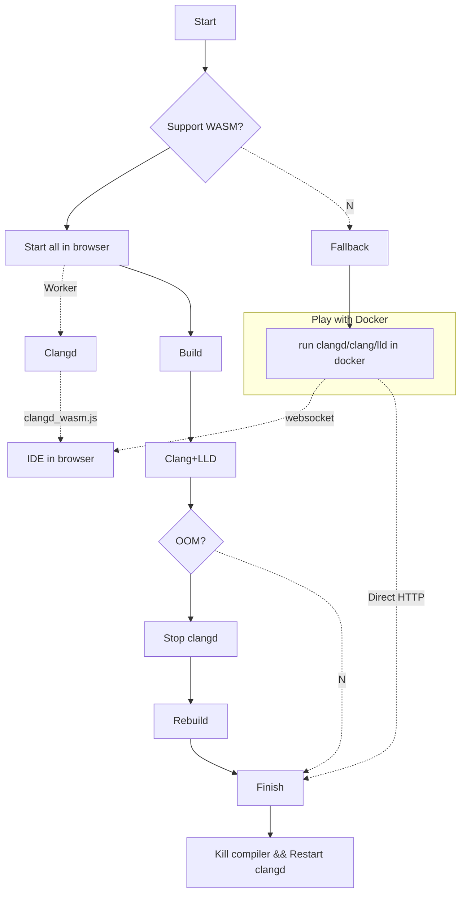

```mermaid
flowchart TB
  Start
  -->SupportWASM{"Support WASM?"}
  -->StartWASM["Start all in browser"]
  -."Worker".->Clangd["Clangd"]
  -."clangd_wasm.js".->IDE["IDE in browser"]
  StartWASM
  -->Build
  -->Clang+LLD
  -->OOM{OOM?}
  -->Stop["Stop clangd"]
  -->Rebuild
  -->FinishBuild["Finish"]
  -->Restart["Kill compiler && Restart clangd"]
  OOM-.N.->FinishBuild

  SupportWASM
  -.N.->Fallback-->DockerImg
    subgraph Play with Docker
    DockerImg["run clangd/clang/lld in docker"]
    end
  DockerImg-."websocket".->IDE
  DockerImg-."Direct HTTP".->FinishBuild
```
